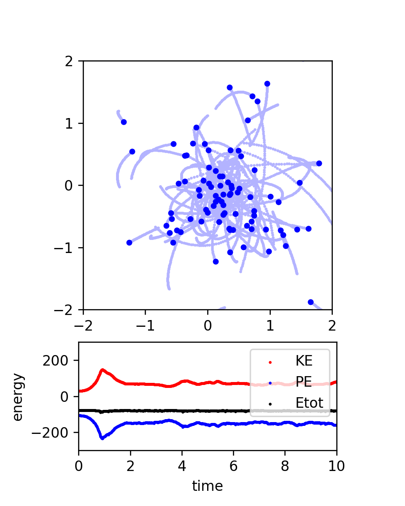

# nbody-python
Vectorized N-body code (Python)

## Create Your Own N-body Simulation (With Python)

### Philip Mocz (2020) Princeton Univeristy, [@PMocz](https://twitter.com/PMocz)

Simulate orbits of stars interacting due to gravity

Code calculates pairwise forces according to Newton's Law of Gravity

```
python nbody.py
```


